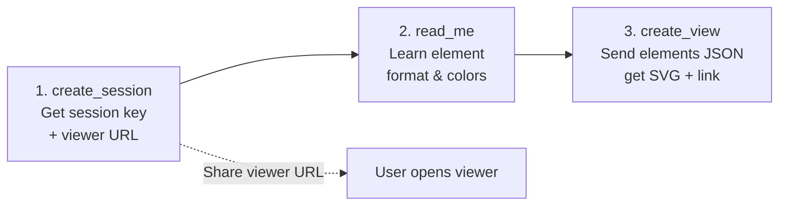

# Excalidraw Sidecar MCP

Excalidraw Sidecar MCP 是一个远程 MCP 服务器，让外部 LLM 通过 HTTP 创建 Excalidraw 图表。提供浏览器实时查看与编辑、服务端 SVG 渲染。API 参考见 [docs/remote-mcp-api.md](docs/remote-mcp-api.md)。


## Deploy

For deployment instructions (prerequisites, build, production), see [DEPLOYMENT.md](../../DEPLOYMENT.md).

### CLI Flags

| Flag | Description |
|------|-------------|
| `--static <dir>` | Serve frontend static files from `<dir>` for single-port deployment |
| `--base-url <url>` | Public-facing base URL for viewer links. Use when the server is behind a reverse proxy and cannot detect its own public domain. Takes precedence over the `BASE_URL` environment variable. |
| `--stdio` | Run in stdio mode (for embedded use by backend subprocess) |

## Basic Workflow

Every drawing session follows a three-step workflow:



### Step 1: Create a session

Call the `create_session` tool. It returns:
- **Session key** — used in all subsequent tool calls
- **Viewer URL** — share this with the user so they can open the diagram in a browser

**Important:** Always tell the user the viewer URL immediately after creating the session. They should open it in a browser before you start drawing, so they can watch the diagram appear in real time.

### Step 2: Read the element format reference

Call `read_me` once before your first `create_view`. It returns a cheat sheet with:
- Supported element types (`rectangle`, `ellipse`, `diamond`, `text`, `arrow`)
- Color palette with hex codes
- Coordinate system and sizing conventions
- Full JSON examples

### Step 3: Draw the diagram

Call `create_view` with the session key and a JSON array of Excalidraw elements. It returns:
- An **SVG image** preview of the rendered diagram
- A **checkpoint ID** for incremental edits later

To update the diagram, call `create_view` again with a `restoreCheckpoint` reference and new/modified elements — no need to resend everything.

### Viewing & Editing

The viewer page at the URL from step 1 supports:
- **Live updates** — the page polls for changes every 5 seconds
- **Pan & zoom** — drag to pan, scroll to zoom, double-click to reset
- **Interactive editing** — click "Edit Diagram" to open the full Excalidraw editor; changes sync back when you click "Done Editing"

---

## Connecting LLMs

### Claude Desktop

Add to `claude_desktop_config.json`:

```json
{
  "mcpServers": {
    "excalidraw": {
      "url": "http://localhost:3001/mcp"
    }
  }
}
```

Claude Desktop connects via MCP Streamable HTTP. No API key or auth needed.

Restart Claude Desktop, then ask:

> "Draw an architecture diagram showing a load balancer routing to 3 microservices connected to a shared database"

Claude will call `create_session` → `read_me` → `create_view` and return an SVG image with a viewer link.

### Claude Desktop (stdio mode)

```json
{
  "mcpServers": {
    "excalidraw": {
      "command": "node",
      "args": ["/path/to/excalidraw-sidecar-mcp/dist/index.js", "--stdio"]
    }
  }
}
```

### Claude Code (CLI)

Use the included skill:

```bash
# Via the /draw skill command (if installed)
/draw http://localhost:3001

# Or via the CLI helper directly
node excalidraw-mcp/skill/scripts/mcp-client.mjs --server http://localhost:3001 create-session
```

You can also create a config file at the project root or `~/.excalidraw-mcp.json`:

```json
{
  "server": "http://localhost:3001"
}
```

### Other MCP Clients

Any client supporting [MCP Streamable HTTP](https://modelcontextprotocol.io/specification/2025-03-26/basic/transports#streamable-http) can connect to `http://<host>:3001/mcp`. For protocol handshake details, see [docs/remote-mcp-api.md](docs/remote-mcp-api.md#mcp-protocol).

---

## Usage

### CLI Tool

The included `skill/scripts/mcp-client.mjs` wraps the MCP protocol handshake into simple commands. Zero dependencies beyond Node.js 18+.

**Setup:**

```bash
# Option A: Pass server URL each time
node skill/scripts/mcp-client.mjs --server http://localhost:3001 <command>

# Option B: Create a config file (searched in cwd then home dir)
echo '{"server": "http://localhost:3001"}' > .excalidraw-mcp.json
node skill/scripts/mcp-client.mjs <command>
```

**Commands:**

```bash
# Create a 24h drawing session
node mcp-client.mjs create-session
# → Session key: "abc-123-..."
# → Viewer URL: http://localhost:5173/view/abc-123-...

# Get element format reference (call once before first draw)
node mcp-client.mjs read-me

# Draw elements from a JSON file
node mcp-client.mjs create-view <session_key> elements.json

# Draw elements from stdin
echo '[{"type":"rectangle","id":"r1","x":0,"y":0,"width":200,"height":100}]' \
  | node mcp-client.mjs create-view <session_key> -

# Get current view (includes user edits from browser)
node mcp-client.mjs get-view <session_key>

# Replace all elements via REST API
node mcp-client.mjs update-elements <session_key> new-elements.json

# Delete specific elements by ID
node mcp-client.mjs delete-elements <session_key> id1,id2,id3

# Restore from a checkpoint, optionally adding new elements
node mcp-client.mjs restore-checkpoint <session_key> <checkpoint_id> [extra.json]

# Check session status
node mcp-client.mjs session-info <session_key>
```

### Browser Viewer

Open the viewer URL returned by MCP tools (e.g. `http://localhost:3001/view/<session-key>` with single-domain deployment, or `http://localhost:5173/view/<session-key>` in dev mode):

- See the current diagram rendered as SVG
- **Pan** — click and drag to move around the diagram
- **Zoom** — scroll wheel to zoom in/out; percentage badge shown at bottom-right
- **Reset** — double-click to reset to fit-all view
- Click **Edit Diagram** to open the full Excalidraw editor
- Edit shapes, text, arrows interactively
- Changes sync back to the server automatically when you click **Done Editing**
- The page polls for external updates every 5 seconds

### Claude Code Skill

Copy the `skill/` directory into your Claude Code skills to get the `/draw` command:

```bash
cp -r skill/ /path/to/your/project/.claude/skills/draw/
```

Then use:

```
/draw http://localhost:3001
```

See [skill/SKILL.md](skill/SKILL.md) for full usage guide.

---

## MCP Tools

| Tool | Parameters | Description |
|------|-----------|-------------|
| `create_session` | none | Create a 24h session. Returns session key + viewer URL |
| `read_me` | none | Element format cheat sheet with colors, coordinates, examples |
| `create_view` | `session_key`, `elements` (JSON string) | Render diagram. Returns SVG image + checkpoint ID |
| `get_current_view` | `session_key` | Get latest SVG including browser edits |

## REST API

| Endpoint | Method | Description |
|----------|--------|-------------|
| `/api/sessions/:key` | GET | Session metadata |
| `/api/sessions/:key/elements` | GET | Current elements array |
| `/api/sessions/:key/elements` | PUT | Replace elements |
| `/api/sessions/:key/svg` | GET | Rendered SVG image |

For complete API documentation, see [docs/remote-mcp-api.md](docs/remote-mcp-api.md).

## Credits

Built with [Excalidraw](https://github.com/excalidraw/excalidraw) and the [Model Context Protocol](https://modelcontextprotocol.io).

## License

MIT
